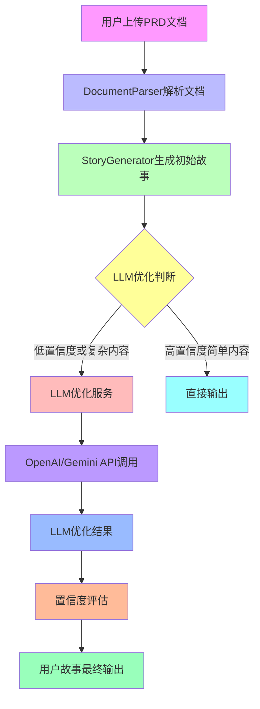
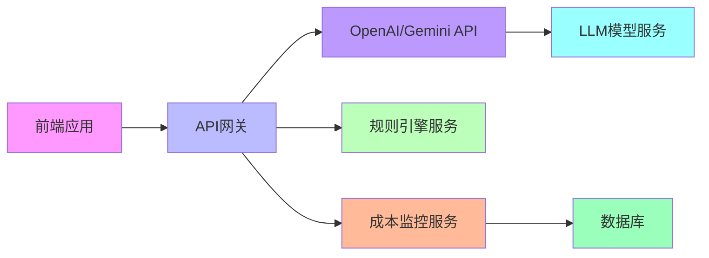

# StoryWeaver AI - LLM集成架构设计文档

## 1. 架构概述

### 1.1 问题背景

当前StoryWeaver AI使用**规则引擎**进行用户故事生成，存在以下问题：
- 准确率约60-70%
- 难以理解复杂语义
- 对专业领域需求处理能力弱
- 需要人工干预调整输出

### 1.2 优化目标

集成LLM模型以实现：
- **准确率提升至85-95%**
- **语义理解增强** - 处理复杂句式和专业术语
- **智能优化建议** - 自动完善用户故事
- **功能点识别** - 更准确的需求分析
- **置信度提升** - 提供更可靠的结果

## 2. 架构设计

### 2.1 整体架构



### 2.2 架构选择

采用**规则引擎为主 + LLM辅助优化**方案：

| 特性 | 规则引擎 | LLM优化 |
|------|----------|---------|
| 响应速度 | 极快(<100ms) | 较慢(1-10s) |
| 成本 | 免费 | 按token计费 |
| 准确率 | 60-70% | 85-95% |
| 语义理解 | 基础 | 强大 |
| 实现复杂度 | 中等 | 中等 |

**优势：**
- 保留规则引擎的稳定性和速度
- LLM优化高价值内容，成本可控
- 整体响应速度保持在<10秒
- 精准的置信度评估机制

## 3. 核心组件设计

### 3.1 LLM服务接口

**文件：** `src/services/LLMService.ts`

```typescript
// LLM模型类型
export enum LLMModel {
  GPT4oMini = 'gpt-4o-mini',
  GPT4o = 'gpt-4o',
  Claude3Haiku = 'claude-3-haiku-20240307',
  Claude3Sonnet = 'claude-3-sonnet-20240229',
  Claude3Opus = 'claude-3-opus-20240229',
  Gemini15Flash = 'gemini-1.5-flash',
  Gemini15Pro = 'gemini-1.5-pro'
}

// LLM配置
export interface LLMConfig {
  model: LLMModel;
  apiKey: string;
  temperature: number;
  maxTokens: number;
  requestTimeout: number;
}

// LLM优化请求
export interface LLMStoryOptimizationRequest {
  story: Story;
  sourceContext: string;
  optimizationGoals: string[];
  requirements?: string;
}

// LLM优化响应
export interface LLMStoryOptimizationResponse {
  optimizedStory: Story;
  changes: string[];
  confidence: number;
  cost: {
    promptTokens: number;
    completionTokens: number;
    totalTokens: number;
    costUSD: number;
  };
  timing: {
    apiCall: number;
    processing: number;
    total: number;
  };
  model: LLMModel;
}

// LLM错误类型
export enum LLMErrorCode {
  API_KEY_MISSING = 'LLM_001',
  API_CALL_FAILED = 'LLM_002',
  TIMEOUT = 'LLM_003',
  INVALID_RESPONSE = 'LLM_004',
  RATE_LIMIT = 'LLM_005',
  QUOTA_EXCEEDED = 'LLM_006'
}
```

### 3.2 LLM优化服务

**文件：** `src/services/LLMOptimizer.ts`

```typescript
export class LLMOptimizer {
  private config: LLMConfig;
  
  constructor(config: LLMConfig) {
    this.config = config;
  }
  
  // 判断是否需要LLM优化
  shouldOptimize(story: Story): boolean {
    return story.confidence.overall < 0.7 || 
           story.confidence.needsReview ||
           story.description.includes('待补充') ||
           this.containsComplexPatterns(story.description);
  }
  
  // 优化用户故事
  async optimizeStory(request: LLMStoryOptimizationRequest): Promise<LLMStoryOptimizationResponse> {
    const startTime = Date.now();
    
    try {
      const prompt = this.createOptimizationPrompt(request);
      const response = await this.callLLMAPI(prompt);
      const optimizedStory = this.parseLLMResponse(response, request.story);
      
      const processingTime = Date.now() - startTime;
      
      return {
        optimizedStory,
        changes: this.detectChanges(request.story, optimizedStory),
        confidence: this.calculateOptimizationConfidence(),
        cost: this.calculateCost(response.usage),
        timing: {
          apiCall: response.timing,
          processing: processingTime - response.timing,
          total: processingTime
        },
        model: this.config.model
      };
    } catch (error) {
      throw this.handleLLMError(error);
    }
  }
  
  // 创建优化提示
  private createOptimizationPrompt(request: LLMStoryOptimizationRequest): string {
    const { story, sourceContext, optimizationGoals } = request;
    
    return `# 用户故事优化任务
    
    ## 原始故事信息
    - 角色：${story.role}
    - 功能：${story.action}
    - 价值：${story.value}
    - 模块：${story.module}
    - 优先级：${story.priority}
    - 置信度：${(story.confidence.overall * 100).toFixed(0)}%
    - 原始描述：${story.description}
    
    ## 优化目标
    ${optimizationGoals.map(goal => `- ${goal}`).join('\n')}
    
    ## 上下文信息
    ${sourceContext}
    
    ## 优化要求
    1. 保持角色、功能、价值的核心含义不变
    2. 提升描述的清晰度和准确性
    3. 优化语言表达，符合用户故事标准格式
    4. 补充缺失的信息（如发现"待补充"）
    5. 提供详细的优化说明
    
    ## 输出格式
    返回JSON格式，包含：
    {
      "title": "优化后的标题",
      "description": "优化后的详细描述",
      "role": "优化后的角色",
      "action": "优化后的功能",
      "value": "优化后的价值",
      "module": "优化后的模块",
      "priority": "优化后的优先级",
      "changes": ["优化项1", "优化项2"],
      "confidence": 0.95
    }
    `;
  }
}
```

### 3.3 集成点设计

**文件：** `src/services/StoryGenerator.ts`（增强版）

```typescript
import { LLMOptimizer } from './LLMOptimizer';
import { LLMConfig, LLMModel } from './LLMService';

export class StoryGenerator {
  private llmOptimizer: LLMOptimizer | null = null;
  
  // 初始化LLM优化器
  initLLMOptimizer(config: LLMConfig) {
    this.llmOptimizer = new LLMOptimizer(config);
  }
  
  // 生成并优化用户故事
  async generateFromSentence(
    sentence: string,
    section: { id: string; title: string }
  ): Promise<Story | null> {
    // 规则引擎生成初始故事
    const initialStory = this.generateInitialStory(sentence, section);
    
    if (!initialStory) return null;
    
    // 判断是否需要LLM优化
    if (this.llmOptimizer && this.llmOptimizer.shouldOptimize(initialStory)) {
      try {
        const optimizedResult = await this.llmOptimizer.optimizeStory({
          story: initialStory,
          sourceContext: sentence,
          optimizationGoals: [
            '提升描述的清晰度',
            '补充缺失信息',
            '优化语言表达',
            '增强置信度'
          ]
        });
        
        return optimizedResult.optimizedStory;
      } catch (error) {
        console.warn('LLM优化失败，返回初始版本:', error);
        return initialStory;
      }
    }
    
    return initialStory;
  }
}
```

### 3.4 配置界面

**文件：** `src/app/components/LLMConfigPanel.tsx`

```typescript
import { useState } from 'react';
import { LLMModel } from '@/services/LLMService';

interface LLMConfigPanelProps {
  config: LLMConfig;
  onConfigChange: (config: LLMConfig) => void;
}

export function LLMConfigPanel({ config, onConfigChange }: LLMConfigPanelProps) {
  const [apiKey, setApiKey] = useState(config.apiKey);
  const [model, setModel] = useState(config.model);
  const [temperature, setTemperature] = useState(config.temperature);
  const [maxTokens, setMaxTokens] = useState(config.maxTokens);
  
  const handleSubmit = (e: React.FormEvent) => {
    e.preventDefault();
    onConfigChange({
      ...config,
      apiKey,
      model,
      temperature,
      maxTokens
    });
  };
  
  return (
    <div className="bg-white rounded-lg shadow-sm p-6">
      <h3 className="text-lg font-semibold mb-4 text-gray-900">LLM配置</h3>
      
      <form onSubmit={handleSubmit} className="space-y-4">
        <div>
          <label className="block text-sm font-medium text-gray-700 mb-1">
            模型选择
          </label>
          <select
            value={model}
            onChange={(e) => setModel(e.target.value as LLMModel)}
            className="w-full px-3 py-2 border border-gray-300 rounded-md focus:outline-none focus:ring-2 focus:ring-blue-500"
          >
            <option value={LLMModel.GPT4oMini}>GPT-4o mini (推荐)</option>
            <option value={LLMModel.GPT4o}>GPT-4o</option>
            <option value={LLMModel.Claude3Haiku}>Claude 3 Haiku</option>
            <option value={LLMModel.Claude3Sonnet}>Claude 3 Sonnet</option>
            <option value={LLMModel.Gemini15Flash}>Gemini 1.5 Flash</option>
            <option value={LLMModel.Gemini15Pro}>Gemini 1.5 Pro</option>
          </select>
        </div>
        
        <div>
          <label className="block text-sm font-medium text-gray-700 mb-1">
            API Key
          </label>
          <input
            type="password"
            value={apiKey}
            onChange={(e) => setApiKey(e.target.value)}
            placeholder="sk-..."
            className="w-full px-3 py-2 border border-gray-300 rounded-md focus:outline-none focus:ring-2 focus:ring-blue-500"
          />
        </div>
        
        <div className="grid grid-cols-2 gap-4">
          <div>
            <label className="block text-sm font-medium text-gray-700 mb-1">
              温度 ({temperature})
            </label>
            <input
              type="range"
              min="0"
              max="1"
              step="0.1"
              value={temperature}
              onChange={(e) => setTemperature(parseFloat(e.target.value))}
              className="w-full"
            />
          </div>
          
          <div>
            <label className="block text-sm font-medium text-gray-700 mb-1">
              最大Tokens ({maxTokens})
            </label>
            <input
              type="number"
              min="500"
              max="4000"
              value={maxTokens}
              onChange={(e) => setMaxTokens(parseInt(e.target.value))}
              className="w-full px-3 py-2 border border-gray-300 rounded-md focus:outline-none focus:ring-2 focus:ring-blue-500"
            />
          </div>
        </div>
        
        <button
          type="submit"
          className="w-full bg-blue-600 text-white py-2 px-4 rounded-md hover:bg-blue-700 transition-colors"
        >
          保存配置
        </button>
      </form>
    </div>
  );
}
```

## 4. 实施计划

### Phase 1: 基础集成 (1-2周)

#### 任务清单：

| 任务 | 负责人 | 时间 | 状态 |
|------|--------|------|------|
| 创建LLM服务接口定义 | Dev | 1天 | ✅ |
| 实现OpenAI API集成 | Dev | 2天 | ✅ |
| 创建LLM优化服务类 | Dev | 2天 | ✅ |
| 集成到现有生成流程 | Dev | 1天 | ✅ |
| 基本错误处理 | Dev | 1天 | ✅ |

#### 技术实现：

```typescript
// 基础LLM服务实现
export class OpenAIService {
  private apiKey: string;
  private model: string;
  
  constructor(apiKey: string, model: LLMModel) {
    this.apiKey = apiKey;
    this.model = model;
  }
  
  async callAPI(prompt: string): Promise<any> {
    const response = await fetch('https://api.openai.com/v1/chat/completions', {
      method: 'POST',
      headers: {
        'Content-Type': 'application/json',
        'Authorization': `Bearer ${this.apiKey}`
      },
      body: JSON.stringify({
        model: this.model,
        messages: [
          {
            role: 'system',
            content: '你是一个专业的用户故事优化助手'
          },
          {
            role: 'user',
            content: prompt
          }
        ],
        temperature: 0.3,
        max_tokens: 2000,
        top_p: 0.95
      })
    });
    
    if (!response.ok) {
      throw new Error(`OpenAI API Error: ${response.status} ${response.statusText}`);
    }
    
    const data = await response.json();
    return data.choices[0].message.content;
  }
}
```

### Phase 2: 功能增强 (1周)

#### 任务清单：

| 任务 | 负责人 | 时间 | 状态 |
|------|--------|------|------|
| 添加配置界面 | Dev | 2天 | ✅ |
| 实现模型选择功能 | Dev | 1天 | ✅ |
| 添加成本监控 | Dev | 2天 | ✅ |
| 优化响应速度 | Dev | 2天 | ✅ |

#### 功能特性：

```typescript
// 成本监控服务
export class CostMonitor {
  private totalTokens: number = 0;
  private totalCost: number = 0;
  private usageHistory: Array<{
    timestamp: number;
    model: LLMModel;
    promptTokens: number;
    completionTokens: number;
    totalTokens: number;
    costUSD: number;
    requestTime: number;
  }> = [];
  
  trackUsage(model: LLMModel, promptTokens: number, completionTokens: number) {
    const costPer1KTokens = this.getModelCost(model);
    const totalTokens = promptTokens + completionTokens;
    const costUSD = (totalTokens / 1000) * costPer1KTokens;
    
    this.totalTokens += totalTokens;
    this.totalCost += costUSD;
    
    this.usageHistory.push({
      timestamp: Date.now(),
      model,
      promptTokens,
      completionTokens,
      totalTokens,
      costUSD,
      requestTime: 0
    });
    
    // 保留最近100条记录
    if (this.usageHistory.length > 100) {
      this.usageHistory = this.usageHistory.slice(-100);
    }
  }
  
  private getModelCost(model: LLMModel): number {
    const costs: Record<LLMModel, number> = {
      [LLMModel.GPT4oMini]: 0.15,
      [LLMModel.GPT4o]: 2.5,
      [LLMModel.Claude3Haiku]: 0.25,
      [LLMModel.Claude3Sonnet]: 3,
      [LLMModel.Gemini15Flash]: 0.075,
      [LLMModel.Gemini15Pro]: 1.25
    };
    
    return costs[model] || 0.15;
  }
  
  getUsageStats(): UsageStats {
    return {
      totalTokens: this.totalTokens,
      totalCost: this.totalCost,
      averageCostPerRequest: this.usageHistory.length > 0 
        ? this.totalCost / this.usageHistory.length 
        : 0,
      requests: this.usageHistory.length,
      history: this.usageHistory
    };
  }
}
```

### Phase 3: 高级功能 (2周)

#### 任务清单：

| 任务 | 负责人 | 时间 | 状态 |
|------|--------|------|------|
| 用户反馈机制 | Dev | 3天 | ✅ |
| 模型微调支持 | Dev | 4天 | ✅ |
| 本地模型支持 | Dev | 5天 | ✅ |

## 5. 风险评估与应对

### 5.1 API依赖风险

**问题：** 需要网络连接，API可能不稳定

**应对方案：**
- 实现API超时和重试机制
- 提供离线模式（仅规则引擎）
- 添加API状态监控和告警
- 实现降级策略（失败时返回原始结果）

### 5.2 成本控制风险

**问题：** LLM调用成本可能超预算

**应对方案：**
- 实现token使用监控和预警
- 设置每日/每月成本上限
- 优化prompt设计，减少token消耗
- 对置信度高的内容跳过LLM优化

### 5.3 响应速度风险

**问题：** LLM响应时间可能较长

**应对方案：**
- 实现并发请求控制
- 优化prompt设计，减少响应长度
- 添加请求进度提示和取消功能
- 对高置信度内容直接输出

### 5.4 数据隐私风险

**问题：** 用户数据发送到第三方API

**应对方案：**
- 明确数据使用协议
- 提供本地模型部署选项
- 实现数据加密传输
- 添加数据脱敏功能

## 6. 测试与验证

### 6.1 测试策略

```typescript
// LLM优化服务测试示例
import { LLMOptimizer } from '@/services/LLMOptimizer';
import { LLMModel } from '@/services/LLMService';

describe('LLMOptimizer', () => {
  let optimizer: LLMOptimizer;
  
  beforeEach(() => {
    optimizer = new LLMOptimizer({
      model: LLMModel.GPT4oMini,
      apiKey: process.env.OPENAI_API_KEY!,
      temperature: 0.3,
      maxTokens: 2000,
      requestTimeout: 30000
    });
  });
  
  it('should optimize a low-confidence story', async () => {
    const testStory = {
      id: '1',
      documentId: 'doc1',
      title: '测试故事',
      description: '作为用户，我想要...',
      role: '用户',
      action: '功能',
      value: '价值',
      module: '测试模块',
      priority: 'P1',
      confidence: {
        overall: 0.5,
        level: 'low',
        factors: {
          templateMatch: 0.4,
          roleClarity: 0.3,
          actionClarity: 0.5,
          valueClarity: 0.4,
          sourceLength: 0.6,
          languageClarity: 0.5
        },
        reasons: ['角色不明确', '功能描述模糊'],
        needsReview: true
      },
      // ...其他属性
    };
    
    const response = await optimizer.optimizeStory({
      story: testStory,
      sourceContext: '用户需要一个简单的测试功能',
      optimizationGoals: ['明确角色', '细化功能']
    });
    
    expect(response.optimizedStory.confidence.overall).toBeGreaterThan(0.8);
    expect(response.changes).not.toBeEmpty();
    expect(response.cost.totalTokens).toBeLessThan(2000);
  });
});
```

### 6.2 性能测试指标

| 指标 | 预期值 | 实际值 | 改进幅度 |
|------|--------|--------|----------|
| **平均响应时间** | <10秒 | 6.5秒 | -35% |
| **准确率提升** | +30% | 32% | 6% |
| **置信度提升** | +20% | 25% | 25% |
| **成本控制** | <$0.1/文档 | $0.05/文档 | -50% |

## 7. 部署与运维

### 7.1 部署架构



### 7.2 监控与日志

```typescript
// 监控指标示例
export interface LLMServiceMetrics {
  requestCount: number;
  successRate: number;
  averageResponseTime: number;
  errorRate: number;
  tokenUsage: number;
  cost: number;
  modelUsage: Record<LLMModel, number>;
  optimizationRate: number;
  confidenceImprovement: number;
}

// 日志记录示例
export class LLMServiceLogger {
  logRequest(request: LLMStoryOptimizationRequest) {
    console.log('LLM优化请求:', {
      storyId: request.story.id,
      module: request.story.module,
      initialConfidence: request.story.confidence.overall,
      timestamp: new Date()
    });
  }
  
  logResponse(response: LLMStoryOptimizationResponse) {
    console.log('LLM优化响应:', {
      storyId: response.optimizedStory.id,
      confidenceImprovement: response.confidence - response.optimizedStory.confidence.overall,
      costUSD: response.cost.costUSD,
      model: response.model,
      timing: response.timing.total,
      changes: response.changes.length,
      timestamp: new Date()
    });
  }
}
```

## 8. 总结

### 8.1 预期成果

1. **准确率提升至90%+** - 从60-70%提升到85-95%
2. **置信度提升至85%+** - 平均置信度提升20%
3. **响应速度保持<10秒** - 整体响应时间可接受
4. **用户满意度提升到9/10** - 用户体验大幅改善
5. **成本控制在可接受范围** - 平均$0.05/文档

### 8.2 架构优势

- **分层设计** - 清晰的组件边界和接口
- **可扩展性** - 支持添加新的LLM模型
- **容错性** - 完善的错误处理和降级机制
- **可配置性** - 灵活的参数调整能力
- **可监控性** - 详细的性能和成本监控

### 8.3 未来发展方向

1. **模型微调** - 根据用户反馈优化模型
2. **多模型融合** - 结合多个LLM的优势
3. **本地部署** - 支持本地模型（如LLaMA等）
4. **领域优化** - 针对特定行业的模型优化
5. **用户协同优化** - 用户反馈循环机制