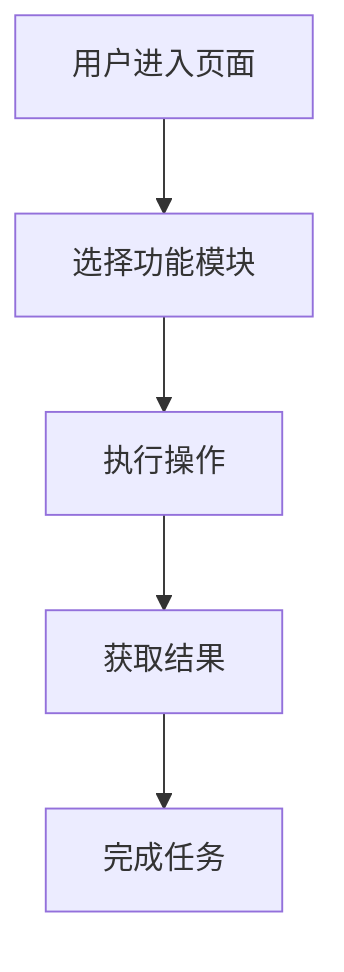

# PRD（产品需求文档）模板

## 版本记录

| 版本 | 日期 | 作者 | 修改内容 | 评审状态 |
|------|------|------|----------|----------|
| v1.0 | 2026-02-16 | 产品经理 | 初始版本 | 待评审 |

## 文档综述

### 项目背景
[描述产品开发的背景和原因，包括市场趋势、用户需求、业务目标等]

### 产品目标
- **核心目标**：[产品要解决的主要问题]
- **次要目标**：[辅助性的目标]

### 产品范围
- **包含功能**：[本次迭代要实现的功能列表]
- **不包含功能**：[明确说明本次不实现的功能]

## 产品概述

### 用户画像
| 用户角色 | 核心需求 | 使用场景 | 痛点问题 |
|----------|----------|----------|----------|
| [用户角色1] | [主要需求] | [典型场景] | [主要痛点] |
| [用户角色2] | [主要需求] | [典型场景] | [主要痛点] |

### 痛点分析
1. **问题1**：[详细描述痛点]
   - **影响**：[对用户的影响]
   - **解决方案**：[产品提供的解决思路]

2. **问题2**：[详细描述痛点]
   - **影响**：[对用户的影响]
   - **解决方案**：[产品提供的解决思路]

## 核心功能

### 功能列表
| 功能模块 | 功能点 | 优先级 | 复杂度 | 预计工时 |
|----------|--------|--------|--------|----------|
| [模块1] | [功能1] | P0 | 中 | 3天 |
| [模块1] | [功能2] | P1 | 低 | 1天 |
| [模块2] | [功能3] | P0 | 高 | 5天 |

### 优先级定义
- **P0**：必须实现的核心功能，不实现会导致产品无法使用
- **P1**：重要功能，提升用户体验或核心流程完整性
- **P2**：次要功能，优化或辅助性功能

## 用户场景

### 用户故事
| 编号 | 用户故事 | 验收标准 | 相关功能 |
|------|----------|----------|----------|
| US001 | 作为[用户角色]，我希望[需求]，以便[价值] | [验收条件] | [功能点] |
| US002 | 作为[用户角色]，我希望[需求]，以便[价值] | [验收条件] | [功能点] |

### 使用流程

## 功能详情

### 页面设计
| 页面名称 | 页面功能 | 核心元素 | 交互逻辑 |
|----------|----------|----------|----------|
| [页面1] | [页面功能描述] | [核心元素列表] | [交互逻辑] |
| [页面2] | [页面功能描述] | [核心元素列表] | [交互逻辑] |

### 交互逻辑
#### 功能1交互流程
1. 用户操作：[具体操作]
2. 系统响应：[系统反馈]
3. 异常处理：[错误场景处理]

#### 功能2交互流程
1. 用户操作：[具体操作]
2. 系统响应：[系统反馈]
3. 异常处理：[错误场景处理]

## 验收标准

### 功能验收
| 功能点 | 验收条件 | 测试方法 |
|--------|----------|----------|
| [功能1] | [验收条件] | [测试方法] |
| [功能2] | [验收条件] | [测试方法] |

### 非功能需求
- **性能要求**：[响应时间、并发量等]
- **兼容性要求**：[浏览器、设备支持]
- **安全性要求**：[数据加密、权限控制]
- **可访问性要求**：[WCAG标准]

## 风险和约束

### 技术风险
| 风险项 | 影响程度 | 发生概率 | 缓解措施 |
|--------|----------|----------|----------|
| [风险1] | 高 | 中 | [缓解方法] |
| [风险2] | 中 | 低 | [缓解方法] |

### 业务约束
- [约束条件1]：[详细描述]
- [约束条件2]：[详细描述]

## 附件

- [产品原型链接]
- [设计稿链接]
- [相关技术文档]

