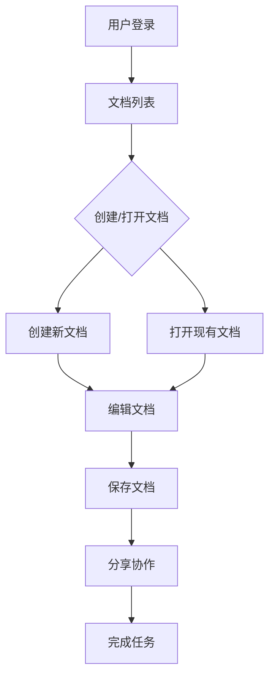

# 在线文档编辑器 PRD

## 版本记录

| 版本 | 日期 | 作者 | 修改内容 | 评审状态 |
|------|------|------|----------|----------|
| v1.0 | 2026-02-16 | 张三 | 初始版本 | 待评审 |

## 文档综述

### 项目背景
随着远程办公和协作需求的增加，用户需要一个轻量级的在线文档编辑器，支持实时协作、版本控制和多设备同步，以替代传统的本地文档编辑工具。

### 产品目标
- **核心目标**：提供一个简单易用的在线文档编辑器，支持实时协作编辑
- **次要目标**：实现文档版本管理和多设备同步功能

### 产品范围
- **包含功能**：文档创建、编辑、实时协作、版本历史、导出功能
- **不包含功能**：离线编辑、高级公式编辑、文档模板库

## 产品概述

### 用户画像
| 用户角色 | 核心需求 | 使用场景 | 痛点问题 |
|----------|----------|----------|----------|
| **个人用户** | 快速创建和编辑文档 | 在家办公、学习笔记 | 本地文档容易丢失，无法跨设备同步 |
| **团队用户** | 实时协作编辑文档 | 团队会议、项目协作 | 邮件来回发送文档，版本冲突严重 |

### 痛点分析
1. **文档同步问题**：
   - **影响**：用户在不同设备间切换时，需要重新上传/下载文档，容易丢失或版本不一致
   - **解决方案**：实现自动同步功能，实时保存到云端

2. **协作效率低**：
   - **影响**：团队成员需要通过邮件或聊天工具发送文档，版本管理混乱
   - **解决方案**：提供实时协作功能，支持多人同时编辑和评论

## 核心功能

### 功能列表
| 功能模块 | 功能点 | 优先级 | 复杂度 | 预计工时 |
|----------|--------|--------|--------|----------|
| 文档管理 | 创建新文档 | P0 | 低 | 0.5天 |
| 文档管理 | 导入本地文件 | P1 | 中 | 2天 |
| 文档编辑 | 富文本编辑 | P0 | 高 | 5天 |
| 文档编辑 | 实时协作 | P0 | 高 | 6天 |
| 文档编辑 | 版本历史 | P1 | 中 | 3天 |
| 文档编辑 | 导出功能 | P1 | 低 | 1天 |

### 优先级定义
- **P0**：必须实现的核心功能，不实现会导致产品无法使用
- **P1**：重要功能，提升用户体验或核心流程完整性
- **P2**：次要功能，优化或辅助性功能

## 用户场景

### 用户故事
| 编号 | 用户故事 | 验收标准 | 相关功能 |
|------|----------|----------|----------|
| US001 | 作为个人用户，我希望能够快速创建新文档，以便立即开始写作 | 1. 点击"新建文档"按钮即可创建空白文档 2. 文档自动保存到云端 3. 支持从模板创建文档 | 文档创建、模板库 |
| US002 | 作为团队用户，我希望能够与同事实时协作编辑同一份文档，以便提高工作效率 | 1. 多人可以同时编辑同一份文档 2. 可以看到其他用户的编辑位置和输入内容 3. 支持实时评论和回复功能 | 实时协作、评论功能 |

### 使用流程

## 功能详情

### 页面设计
| 页面名称 | 页面功能 | 核心元素 | 交互逻辑 |
|----------|----------|----------|----------|
| 文档列表页 | 显示用户的所有文档 | 文档卡片、搜索框、新建按钮 | 点击文档卡片打开文档，搜索框支持关键词搜索 |
| 文档编辑页 | 文档编辑和协作 | 编辑器区域、工具栏、评论面板 | 实时显示其他用户的编辑位置，评论支持@功能 |

### 交互逻辑
#### 文档创建交互流程
1. 用户操作：点击"新建文档"按钮
2. 系统响应：创建一个新的空白文档，自动保存到云端
3. 异常处理：网络失败时显示错误提示，文档保存在本地

#### 实时协作交互流程
1. 用户操作：邀请其他用户加入协作
2. 系统响应：发送邀请链接，对方接受后进入编辑模式
3. 异常处理：用户网络断开时显示离线状态，重连后同步内容

## 验收标准

### 功能验收
| 功能点 | 验收条件 | 测试方法 |
|--------|----------|----------|
| 文档创建 | 1. 点击"新建文档"按钮立即创建新文档 2. 文档自动保存到云端 3. 支持从模板创建文档 | 手动测试、自动化测试 |
| 实时协作 | 1. 多人同时编辑同一文档 2. 实时显示其他用户的编辑位置 3. 评论功能正常使用 | 集成测试、用户测试 |

### 非功能需求
- **性能要求**：编辑器响应时间 < 200ms，同步延迟 < 500ms
- **兼容性要求**：支持 Chrome 90+、Firefox 88+、Safari 14+
- **安全性要求**：文档加密传输，支持权限控制
- **可访问性要求**：符合 WCAG 2.0 AA 标准

## 风险和约束

### 技术风险
| 风险项 | 影响程度 | 发生概率 | 缓解措施 |
|--------|----------|----------|----------|
| 实时协作性能 | 高 | 中 | 优化同步算法，使用 CDN 加速 |
| 数据安全 | 高 | 低 | 加密存储和传输，定期备份 |

### 业务约束
- 开发周期限制：3个月内完成 MVP 版本
- 预算限制：前端开发团队 4人，后端开发团队 2人

## 附件

- [产品原型链接](https://example.com/prototype)
- [设计稿链接](https://example.com/design)
- [相关技术文档](https://example.com/techdocs)

